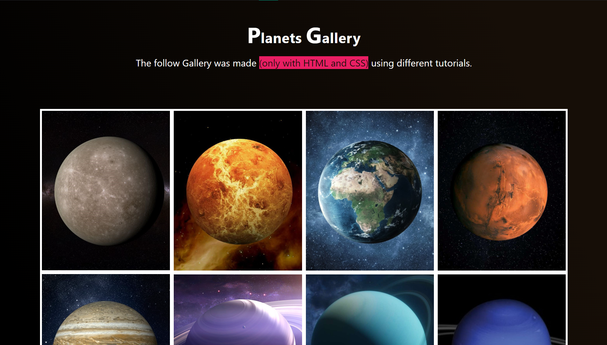

# Gallery Page
 <!-- HTML -->
 <!-- CSS -->
 <!-- VSCode -->
 <!-- README -->

<br>

## 💻 Projeto

Página de uma galeria com temática "planetária" que apresenta possibilidade de responsividade entre dispositivos.

<br>

Produzido a partir de diferentes tutoriais encontrados no Instagram, como de <a href="https://www.instagram.com/p/CfMDNMUDClF/?utm_source=ig_web_copy_link">header</a> e <a href="https://www.instagram.com/p/ChCYDrKDAa9/?utm_source=ig_web_copy_link">footer</a> responsivos.

<br>

### 👓 Veja você mesmo
Para ter o projeto na sua máquina local, siga este tutorial:
<br>

1. Vá até a página inicial do repositório do projeto.

2. Selecione a opção "<> Code".

3. Copie o link HTTPS do projeto.

4. Escolha um local de preferência na sua máquina e execute o Git lá dentro.

5. Clone o repositório utilizando o comando "git clone [link]":

```bash
git clone https://github.com/VitorDelabenetta/Gallery-Page.git
```
6. Abra o projeto em seu ambiente de desenvolvimento para trabalhar no código ou simplesmente execute o arquivo "index.html" usando o navegador.

<br>

## Preview



<i>Imagem de preview da galeria planetária.</i>

<br>

## 🛠 Tecnologias

Esse projeto foi desenvolvido com as seguintes ferramentas e tecnologias:

- HTML;
- CSS (responsivo);
- Virtual Studio Code;
- Git.